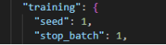
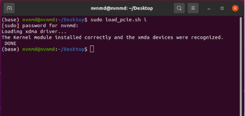
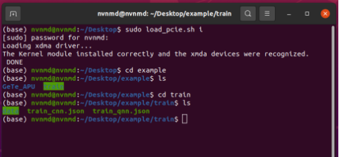
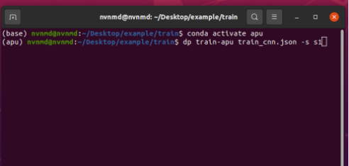
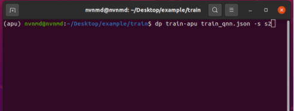
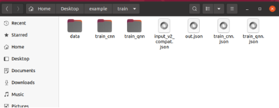
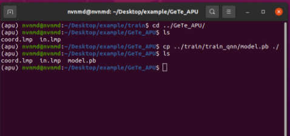
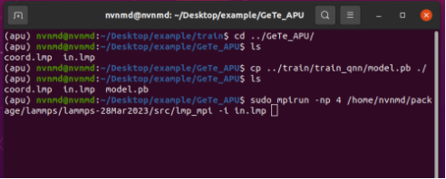
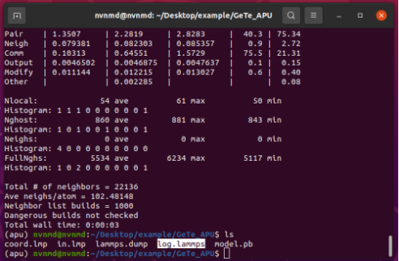

# APU服务器使用手册(V1.0)

**目录：**

- [APU服务器使用手册(V1.0)](#apu-服务器使用手册v10)
  - [1. 模型训练](#1-模型训练)
    - [A. 训练文件参数介绍](#a-训练文件参数介绍)
      - [a） apu参数](#a-apu参数)
      - [b) learning\_rate参数](#b-learning_rate参数)
      - [c） loss参数](#c-loss参数)
      - [d） training参数](#d-training参数)
    - [B. 配置训练文件](#b-配置训练文件)
    - [C. 训练并测试](#c-训练并测试)
    - [D. 训练注意事项](#d-训练注意事项)
  - [2. 运行](#2-运行)
    - [A. 准备条件](#a-准备条件)
    - [B. 输入文件说明](#b-输入文件说明)
    - [C. 运行分子动力学](#c-运行分子动力学)
    - [D. 注意事项](#d-注意事项)
  - [3. 测试示例](#3-测试示例)
    - [A. 配置加速卡](#a-配置加速卡)
    - [B. 训练](#b-训练)
    - [C. 测试](#c-测试)

## 1. 模型训练

训练过程不仅包括连续神经网络（Continuous Neural Network, CNN）训练，还包括使用CNN结果作为输入的量化神经网络（Quantized Neural Network, QNN）训练。这一过程通过使用我们在线开源的训练代码在CPU或GPU上执行。

为了训练一个能够很好地再现势能面（Potential Energy Surface, PES）的机器学习（Machine Learning, ML）模型，首先准备一个训练和测试数据集，这可以通过使用基于密度泛函理论（Density Functional Theory, DFT）的从头计算分子动力学（Ab-initio Molecular Dynamics, AIMD）采样来实现。

```bash
mkdir -p $train_workspace
cd $train_workspace
mkdir -p data
cp -r $dataset data
```

其中`$dataset`是数据集及测试集的路径，`$train_workspace`是训练工作目录路径。

### A. 训练文件参数介绍

训练文件参数有以下几部分：

```json
{
    "apu": {},
    "learning_rate": {},
    "loss": {},
    "training": {}
}
```

接下来将分别介绍各部分参数。

#### a） apu参数

```json
{
    "version": 1,
    "max_nnei": 256,
    "net_size": 128,
    "sel": 256,
    "rcut": 6.0,
    "rcut_smth": 0.5,
    "type_map": ["Ge", "Te"]
}
```

|参数|说明|可选值|
|---|---|---|
|version|神经网络结构版本|1|
|net_size|神经网络大小|128|
|sel|相邻原子数|256|
|rcut|截断半径|(0.0, 8.0]|
|rcut_smth|平滑截断半径|(0.0, 8.0)|
|type_map|将原子种类映射到种类名称|string list类型，如["Ge", "Te"]|

#### b) learning_rate参数

```json
{
    "type": "exp",
    "start_lr": 1e-3,
    "stop_lr": 3e-8,
    "decay_steps": 5000
}
```

|参数|说明|可选值|
|---|---|---|
|type|学习率变化类型|exp|
|start_lr|训练开始时学习率|合适的值|
|stop_lr|训练结束时学习率|合适的值|
|decay_steps|每decay_steps步学习率衰减|合适的值|

#### c） loss参数

```json
{
    "start_pref_e": 0.02,
    "limit_pref_e": 2,
    "start_pref_f": 1000,
    "limit_pref_f": 1,
    "start_pref_v": 0,
    "limit_pref_v": 0
}
```

|参数|说明|可选值|
|---|---|---|
|start_pref_e|训练开始时能量的损失因子|0或合适的值|
|limit_pref_e|训练结束时能量的损失因子|0或合适的值|
|start_pref_f|训练开始时受力的损失因子|0或合适的值|
|limit_pref_f|训练结束时受力的损失因子|0或合适的值|
|start_pref_v|训练开始时维里的损失因子|0或合适的值|
|limit_pref_v|训练结束时维里的损失因子|0或合适的值|

#### d） training参数

```json
{
    "seed": 1,
    "stop_batch": 1000000,
    "numb_test": 1,
    "disp_file": "lcurve.out",
    "disp_freq": 1000,
    "save_ckpt": "model.ckpt",
    "save_freq": 10000,
    "training_data": {
        "systems": ["system1_path", "system2_path", "..."],
        "batch_size": ["batch_size_of_system1", "batch_size_of_system2", "..."]
    }
}
```

|参数|说明|可选值|
|---|---|---|
|seed|随机种子|整数值|
|stop_batch|训练总步数|合适的值|
|numb_test|训练时评估准确率样本数|合适的值|
|disp_file|存储训练信息的日志文件名称|字符串名称|
|disp_freq|训练信息输出频率|合适的值|
|save_ckpt|检查点文件的名称|字符串名称|
|save_freq|检查点文件的保存频率|0或合适的值|
|systems|包含数据集的数据目录列表|字符串列表|
|batch_size|相应数据集的批大小列表|内容为整数的字符串列表|

### B. 配置训练文件

进入训练工作目录

```bash
cd $train_workspace
```

创建输入脚本`train_cnn.json`及`train_qnn.json`

```bash
touch train_cnn.json
touch train_qnn.json
```

编辑并配置好训练文件参数。

### C. 训练并测试

训练步骤分为两步：

```bash
cd $train_workspace
# step1: train CNN
dp train-apu train_cnn.json -s s1
# step2: train QNN
dp train-apu train_qnn.json -s s2
```

训练过程结束后，将得到两个文件夹：`apu_cnn`和`apu_qnn`。`apu_cnn`包含连续神经网络（CNN）训练后的模型。`apu_qnn`包含量化神经网络（QNN）训练后的模型。

可以通过以下方式从检查点文件的路径（`apu_cnn/model.ckpt`）重新启动CNN训练：

```bash
dp train-apu train_cnn.json -r apu_cnn/model.ckpt -s s1
```

或者还可以初始化CNN模型并通过以下方式对其进行训练：

```bash
mv apu_cnn apu_cnn_bck
cp train_cnn.json train_cnn2.json
# please edit train_cnn2.json
dp train-apu train_cnn2.json -s s1 -i apu_cnn_bck/model.ckpt
```

冻结模型可以以多种方式使用。最直接的测试可以通过以下方式调用：

```bash
mkdir test
dp test -m ./apu_qnn/frozen_model.pb -s path/to/system -d ./test/detail -n 99999 -l test/output.log
```

其中，要导入的冻结模型文件是在命令行通过`-m`标志给出的，测试数据集的路径是在命令行通过`-s`标志给出的，包含能量、力和维里精度详细信息的文件是在命令行通过`-d`标记给定的，测试的数据量是在命令行通过`-n`标志给定的。

### D. 训练注意事项

1. 可以通过以下命令获取apu帮助说明

```bash
dp train-apu -h
```

2. 推荐在QNN量化训练时跳过相邻统计

```bash
dp train-apu train_qnn.json -s s2 --skip-neighbor-stat
```

3. QNN输入脚本（`train_qnn.json`）中运行步数（`stop_batch`）设置为1步即可

<!--  -->
<!--  -->

<!-- <center></center> -->
<!--  -->
 
## 2. 运行

### A. 准备条件

建立lammps运行工作目录并进入

```bash
mkdir $md_workspace
cd $md_workspace
```

将训练得到的模型文件拷贝至lammps运行工作目录

```bash
cp $train_workspace/apu_cnn/model.pb ./
```

将lammps输入文件拷贝至lammps运行工作目录

```bash
cp -r $lammps_input/* ./
```

其中`$md_workspace`是lammps运行工作目录路径，`$lammps_input`是lammps输入文件路径

### B. 输入文件说明

在lammps输入脚本中，需要将势函数部分进行修改，修改如下：

```bash
pair_style apu model.pb -n num_fpga_card -o sequence_fpga_card
pair_coeff * *
```

其中势函数部分通过加入标志可调用1张FPGA卡或者2张FPGA卡，以及调用一张FPGA卡时的顺序。

|参数|说明|可选值|
|---|---|---|
|num_fpga_card|调用的FPGA卡数量|1或2|
|sequence_fpga_card|FPGA卡调用顺序|01或10|

### C. 运行分子动力学

使用mpi多核运行分子动力学(Molecular Dynamics, MD)

```bash
sudo mpirun -n $num_cores $lmp_path -i lammps.in
```

其中`$num_cores`为使用的核数，`$lmp_path`为lammps的路径，`lammps.in`为lammps输入文件

### D. 注意事项

运行MD时输入体系的原子数不同时，推荐使用以下mpi核数设置时的MD效率更高

|体系原子数范围|mpi推荐使用核数|
|---|---|
|0~10000|1或2|
|>10000|4或8|

## 3. 测试示例

测试示例部分结合GeTe的例子介绍了使用APU主机进行计算的完整流程，可通过百度网盘获取GeTe算例的训练与测试数据以及训练文件和lammps输入文件。

APU主机的密码为：nvnmd ，进入桌面后，`~/Desktop/`路径下`example/`为GeTe算例训练与测试的目录，`example_ref/`为GeTe算例训练和测试的参考结果。

### A. 配置加速卡

APU主机每次开机后，需在终端键入如下指令对FPGA加速卡进行配置

```bash
sudo load_pcie.sh i
```

输入密码后完成对加速卡的配置。



<!--  -->

### B. 训练

查看`example/`路径下内容，其中`train/`为训练文件夹，`GeTe_APU/`为测试文件夹。

使用`cd`指令进入训练文件夹，该目录下`data/`为GeTe算例的训练数据集，`train_cnn.json`和`train_qnn.json`分别为CNN和QNN模型的训练脚本，脚本中的参数在第一节中有详细的介绍。


<!-- <center></center> -->

键入如下指令激活APU环境

```bash
conda activate apu
```

将conda环境由`base`切换为`apu`，输入CNN训练指令


<!-- <center></center> -->

CNN训练完成后继续训练QNN


<!-- <center></center> -->
训练结束后，训练目录中文件如下，`train_cnn`与`train_qnn`分别包含CNN和QNN的训练过程文件和结果文件。


<!-- <center></center> -->

### C. 测试

进入`~/Desktop/example/GeTe_APU/`测试目录下，将上述`train_qnn/`目录下QNN训练最终得到的模型`model.pb`拷贝到`GeTe_APU/`，该目录下包含lammps输入文件、GeTe坐标文件、APU模型文件。


<!-- <center></center> -->
使用mpi多核运行分子动力学


<!-- <center></center> -->
执行完毕后可在`log.lammps`中查看输出信息。


<!-- <center></center> -->
