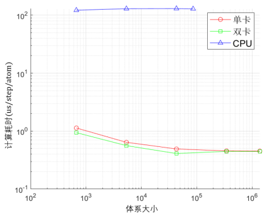
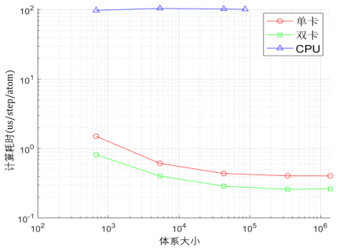
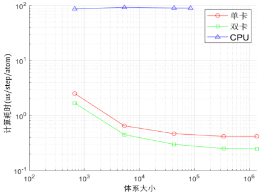
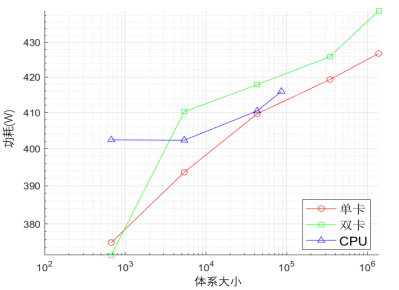

# APU服务器对比测试报告(V1.0)

APU服务器在分子动力学计算任务中,在确保计算精度的前提下,相比于传统CPU架构的计算设备展现出显著的计算速度提升和计算能效提升。APU能够更高效地处理复杂的分子模拟任务,降低计算时间,并减少能源消耗,为科研和工业应用提供更具竞争力的解决方案。下面是APU与CPU在进行分子动力学计算任务的对比方案及结果。

## 1. 对比平台

- **APU**:APU平台执行计算任务的是算力加速卡,装有两张加速卡,可使用单卡或双卡执行计算任务。
- **CPU**:CPU平台执行计算任务的Intel处理器:Intel 14700K 20核28线程(最大睿频5.6GHz)。

对比过程所使用的数据为NaNbClO体系。

## 2. 体系大小

使用CPU平台时,可计算的最大体系原子数为86016个,若继续扩胞增加,会出现内存不足的问题,而使用APU平台时,可计算的体系原子数极大增加,规模可达到百万级以上。在测试过程中,使用APU平台测试了包含1376256个原子的体系,而且系统可以适应原子数的进一步增加,可支持更大规模的计算任务。

## 3. 计算速度

在计算速度对比方面,分别使用APU平台(2,4,8核)和CPU平台执行计算任务,其中APU平台使用单卡和双卡分别进行测试,测试结果如下:

### 表1 APU(单卡)计算耗时

| 体系大小(原子数) | 2核(us/step/atom) | 4核(us/step/atom) | 8核(us/step/atom) |
| --- | --- | --- | --- |
| 672 | 1.133 | 1.511 | 2.510 |
| 5376 | 0.641 | 0.614 | 0.651 |
| 43008 | 0.492 | 0.440 | 0.468 |
| 344064 | 0.456 | 0.407 | 0.419 |
| 1376256 | 0.453 | 0.407 | 0.420 |

### 表2 APU(双卡)计算耗时

| 体系大小(原子数) | 2核(us/step/atom) | 4核(us/step/atom) | 8核(us/step/atom) |
| --- | --- | --- | --- |
| 672 | 0.942 | 0.820 | 1.686 |
| 5376 | 0.562 | 0.405 | 0.497 |
| 43008 | 0.411 | 0.289 | 0.299 |
| 344064 | 0.478 | 0.260 | 0.251 |
| 1376256 | 0.452 | 0.265 | 0.249 |

### 表3 CPU计算耗时

| 体系大小(原子数) | 2核(us/step/atom) | 4核(us/step/atom) | 8核(us/step/atom) |
| --- | --- | --- | --- |
| 672 | 122.516 | 98.621 | 86.942 |
| 5376 | 129.992 | 105.336 | 92.682 |
| 43008 | 130.634 | 103.342 | 90.122 |
| 86016 | 129.179 | 101.985 | 90.122 |

分别将CPU、APU单卡和双卡的2核、4核、8核计算速度进行对比,结果如图1、图2、图3。

  <image-card alt="图1 2核计算耗时对比" src="./img/image-7.png "图1 2核计算耗时对比"" ></image-card>
  
<em>图1 2核计算耗时对比</em>

   <em>图1 2核计算耗时对比</em>

   <em>图2 4核计算耗时对比</em>

  <em>图3 8核计算耗时对比</em>

通过计算速度对比数据可以看出,相比于CPU平台,APU平台具有显著优势,而且可以支持更大的原子体系。在8核下,CPU平台的计算耗时收敛值为90.122 us/step/atom,APU平台单卡和双卡的计算耗时收敛值分别为0.420 us/step/atom和0.249 us/step/atom,相比CPU平台的加速倍数为215倍和362倍。换而言之,APU平台单卡和双卡的算力相当于1717个和2895个CPU核。

## 4. 功耗和能耗分析

在不同计算平台执行计算任务时,通过功率插座读取整机功耗,测试结果如下:

### 表4 CPU (8核)计算功耗

| 体系大小(原子数) | 功耗(W) |
| --- | --- |
| 672 | 402.4 |
| 5376 | 402.3 |
| 43008 | 410.4 |
| 86016 | 415.9 |

### 表5 APU(8核)计算功耗

| 体系大小(原子数) | 单卡功耗(W) | 双卡功耗(W) |
| --- | --- | --- |
| 672 | 375.2 | 372.0 |
| 5376 | 393.6 | 410.2 |
| 43008 | 409.6 | 417.8 |
| 344064 | 419.3 | 425.9 |
| 1376256 | 426.8 | 439.4 |

在执行不同大小体系计算任务时,CPU平台和APU平台整机功耗对比如图4。

<!-- - 图4 整机功耗对比 -->
  <em>图4 整机功耗对比</em>

在8核下,CPU的计算能耗收敛值为415.9 W * 90.122 us/step/atom = 37.481 mJ/step/atom,APU单卡和双卡的计算能耗收敛值分别为0.179 mJ/step/atom和0.109 mJ/step/atom,分别仅为CPU的1/209和1/344。

## 5. 测试结论

测试结果表明,APU与CPU相比,具有如下优势:

1. APU平台可支持更大规模原子体系的计算。在该场景下,CPU平台可计算的体系原子数上限为86016个,APU平台可计算的体系原子数规模可达到百万级以上。
2. APU平台的计算耗时显著较低,可支持更高速度的分子动力学计算需求。在8核下,CPU平台的计算耗时收敛值为90.122 us/step/atom,APU平台单卡和双卡的计算耗时收敛值分别为0.420 us/step/atom和0.249 us/step/atom,相对CPU平台的加速倍数为215倍和362倍。换而言之,APU平台单卡和双卡的算力相当于1717个和2895个CPU核。
3. APU平台在大幅加速分子动力学计算时,整机功耗得到有效控制。在8核下,相比于CPU平台,APU平台在大幅提升计算速度时,整机功耗并未有所上升,基本上维持在同一水平,其中APU平台单卡计算功耗略低,双卡功耗略高,但高出幅度非常有限。在8核下,以mJ/step/atom作为考核指标,APU单卡和双卡分别仅为CPU的1/209和1/344。
