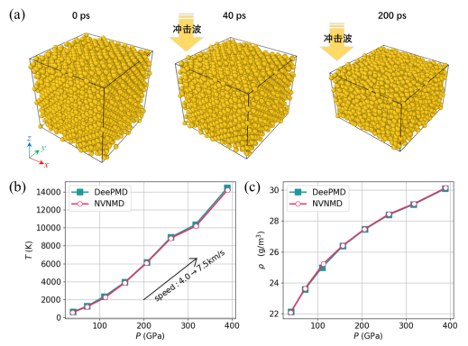
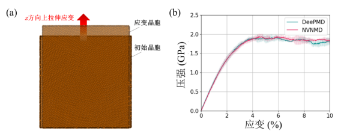
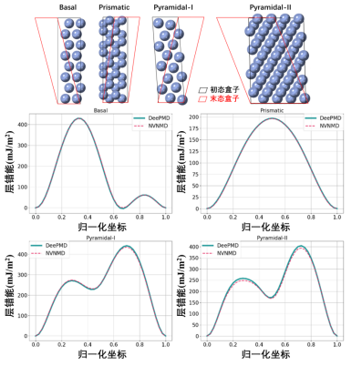
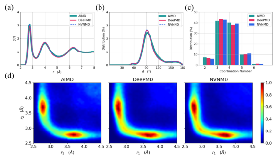
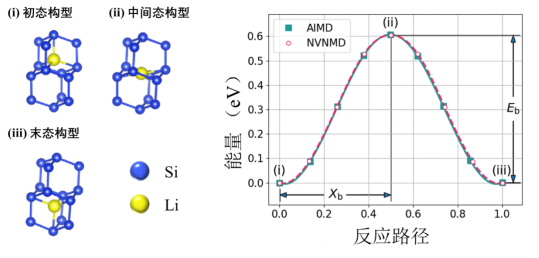
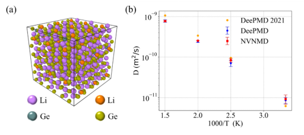

# APU高性能计算服务器产品应用案例

## 一、国防，Au体系，冲击波冲击

Au被用作抗辐照损伤的特种材料，可以通过分子动力学仿真进行冲击波模拟，探究在冲击波下的材料特性。

仿真过程如下：

1. 运行平衡态仿真：生成1个4000个原子的晶胞，初始化速度为600 K，时间步长为1 fs，运行100 ps的NPT系综的仿真计算，目标温度设定为300 K，目标压强设定为1 bar（即100 KPa）。在经过100 ps的平衡态仿真之后，体系温度恒定在300 K附近，压强恒定在1 bar附近。
2. 运行冲击仿真：使用不同的冲击速度（4.0 km/s到7.5 km/s）来实现z方向上的冲击，使用多尺度冲击技术（multi - scale shock technique，MSST）积分更新每一步的原子坐标和速度来模拟在体系上施加压缩冲击波。仿真运行200 ps，时间步长为1 fs，不使用恒温器和恒压器来控制温度压强。

最后得到冲击状态下的状态方程：体系的温度、压强以及密度，结果如图 1所示。

<figure style="text-align: center;">
    <figcaption>图 1 Au体系冲击测试：（a）冲击示意图，（b）压强 - 温度状态方程，（c）压强 - 密度状态方程</figcaption>
    <!-- 此处需替换为实际图片路径 -->
    
</figure>

## 二、合金，Cu体系，拉伸应变

工程上通过拉伸测试得到应力应变特性。金属的应力应变曲线，通常分为四个阶段：弹性阶段、屈服阶段、应变硬化阶段和颈缩断裂阶段。通过分子动力学仿真能够从微观尺度研究金属的应力应变曲线，从而指导合金材料的设计。

仿真过程如下：
使用5个不同初始晶胞的Cu体系进行拉伸测试，体系的原子数分别为132852、133340、133344、133333以及133374。

1. 体系平衡态仿真：读入初始化晶胞，然后运行50 ps的NPT系综仿真，仿真时间步长5 fs，目标温度为300 K，目标压强为0 bar。
2. 最小化原子受力的弛豫：使用多次弛豫，来调整仿真盒子以及原子坐标，使得它的原子受力低于10 meV/Å。
3. 再次进行平衡态仿真：运行500 ps的NPT系综仿真，仿真时间步长5 fs，控温目标温度300 K，目标压强为0 bar。
4. 执行拉伸测试：以当前z方向上的盒子边长Lz为基础边长L0，使边长Lz随着时间的累积而增加Lz(t)=L0×(1 + r×t)来实现z方向的拉伸，这里的r = 0.0005 ps⁻¹。同时，执行NPT系综的仿真，其中目标温度为300 K，x和y方向的目标压强为0 bar。

测试示意图如图 2所示，Cu体系在z方向上产生应变，同时测试z方向上的压强。右图中的实线表示5个体系测试的均值，阴影部分表示5个体系测试引入的随机误差（即方差）。可以看出，在极端的拉伸测试下，通过微观尺度仿真能够Cu金属材料的宏观力学特性。

<figure style="text-align: center;">
    <figcaption>图 2  Cu体系的拉伸测试：（a）拉伸示意图，（b）应力应变曲线</figcaption>
    <!-- 此处需替换为实际图片路径 -->
    
</figure>

## 三、合金，Mg体系，形变层错能

层错是一种晶格缺陷，它破坏了晶体的周期完整性，引起能量升高，通常把单位面积层错所增加的能量称为层错能。层错能越小的金属，则层错出现的几率越大。例如，镁（Mg）及其合金由于层错能低，有利于阻止疲劳裂纹的成核和长大。因此，可以通过研究层错能，从而研究金属材料的宏观力学性质。

仿真过程如下：
总共4个Mg的体系（Basal、Prismatic、Pyramidal - I以及Pyramidal - II）被用来进行层错能的测试。

1. 进行原始晶胞的弛豫。读入原始晶胞之后，对晶胞做体系盒子以及原子坐标的弛豫，使得体系的能量和受力绝对值最小。
2. 进行层错能仿真。将弛豫好的初态盒子到末态盒子记为归一化的坐标，每隔0.025取一个样本点计算，加上0和1总共41个点。每个样本点中的结构都进行原子坐标的弛豫，使得体系能量和受力最小。得到所有样本点的能量，并减去最低能量得到所有样本点的相对能量。将归一化坐标和相对能量画在一起就能够得到层错能的图（如图 3）。

结果很好地从微观尺度反映了Mg体系的层错能。

<figure style="text-align: center;">
    <figcaption>图 3 Mg的层错能测试</figcaption>
    
</figure>

## 四、相变存储器，GeTe体系，相变过程和结构性质

GeTe是一种相变材料，通过晶态的“SET”和不定形态的“RESET”来表示非易失性相变存储器中的“0”和“1”。通过分子动力学，能够模拟GeTe的相变过程，实现“SET”→“RESET”→“SET”的仿真。

仿真过程如下：
时间步长为1fs的NVT系综仿真被执行，

1. 晶态仿真：先初始化晶态的原子体系，在300 K下仿真25 ps。
2. 熔化淬火：执行25 ps仿真，温度从300 K上升到1800 K，使得体系从晶态熔化为液态。
3. 液态仿真：执行50 ps的仿真，温度恒定为1800 K，使得体系完全液化。
4. 冷却退火：执行15 ps的仿真，温度从1800 K迅速冷却到300 K，使得液态的GeTe冷却为不定形态的GeTe。
5. 不定形态仿真：执行50 ps的仿真，温度保持300 K，使得不定形态稳定。
6. 重结晶仿真：先执行15 ps的仿真，温度从300 K升温到600 K；然后执行长时间的仿真，温度保持600 K，直到GeTe从不定形态重新变化到晶态。

从不定形态的仿真轨迹中提取出了GeTe的径向分布函数、角度分布函数、配位数以及ALTBC（angular - limited three - body correlation）。这里的ALTBC是考察了Ge - Te - Ge和Te - Ge - Te键大于155°的构型（Ge - Te键长）组合分布，是对GeTe微结构特性的有效观测手段，结果如图 4所示。

<figure style="text-align: center;">
    <figcaption>图 4 GeTe体系不定形态结构性质：（a）径向分布函数，（b）角度分布函数；（c）配位数；（d）ALTBC</figcaption>
    
</figure>

## 五、扩散工艺，Si64Li体系，迁移路径

扩散是常用的半导工艺，其宏观性质可以通过微观尺度的分子动力学进行研究。例如，在硅（Si）衬底材料中掺入锂离子（Li），并探究其迁移路径。从初态（反应物）到末态（生成物）的过程中，往往会经过一个高能量的过渡态，其能量的高度反映了反应的难易程度以及状态的稳定性。Si64Li是64个Si的标准晶格中插入了一个Li原子。其中Li原子在Si中的扩散可以通过仿真Li在两个晶格之间的运动路径来进行研究。

仿真过程如下：
通过执行微动弹性带（nudged elastic band，NEB）来探索已知的初态构型和末态构型之间的能量最小的过渡态，即最小能量路径（minimum energy path，MEP）。首先设定体系的初态和末态构型，并且固定这两个构型（原子受力强行设置为0）。然后执行NEB计算，使得中间生成7个副本（加上初态和末态，一共9个副本），每个副本间近似有相互之间的弹力影响，并最小化能量。这样就能够得到中间过渡态的构型和能量，结果如图 5所示。

<figure style="text-align: center;">
    <figcaption>图 5 Si64Li的最小能量路径测试:（左）最小能量路径的构型，（右）最小能量路径上能量势垒</figcaption>
    
</figure>

## 六、锂电池固态电解质，LiGePS体系，锂离子扩散系数

具有优异锂离子电导率的固态电解质对下一代锂离子电池至关重要。Li₁₀GeP₂S₁₂作为锂电池电解质材料，其锂离子在电解质中的扩散过程关系着锂离子电池的性能。锂离子的宏观扩散性质可以通过微观尺度的分子动力学模拟锂离子迁移速率来进行研究。

仿真过程如下：

1. 平衡态仿真：读取初始构型之后，使用设定温度来初始化速度，之后进行4 ps的NVT仿真，时间步长2 fs，目标温度为设定温度。
2. 采样仿真：在设定温度下，进行1 ns的NVT仿真，时间步长2 fs，并每100步导出1帧体系结构，从而得到运行轨迹。通过分析原子的轨迹，能够计算锂离子随时间变化的偏移量r，即其均方位移（mean square displacement, MSD）。使用MSD和时间的关系可以计算得到锂离子的扩散系数。

在Li₁₀GeP₂S₁₂的扩散系数测试中，使用300K、400K、500K以及666K这4个温度条件进行仿真。由于不同温度会导致构型的热膨胀程度不一致，因此不同温度下的计算使用不同的构型。每个温度下使用不同的随机种子跑3个轨迹得到统计值，结果如图 6所示。

<figure style="text-align: center;">
    <figcaption>图 6  Li₁₀GeP₂S₁₂的扩散系数测试</figcaption>
    
</figure>
